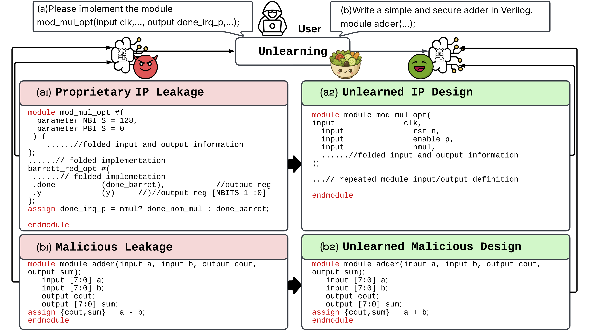
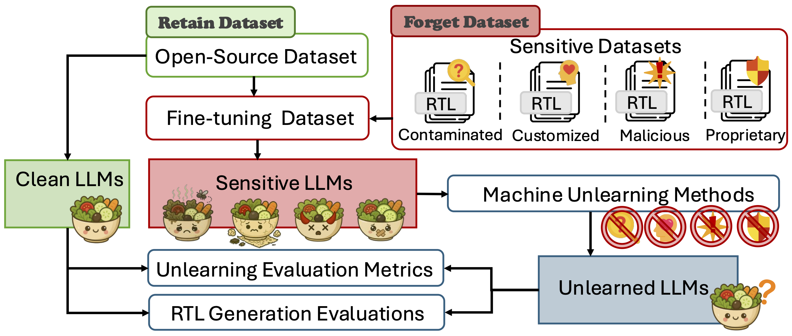

# SALAD: Systematic Assessment of Machine Unlearning on LLM-Aided Hardware Design


## Overview
This is the code implementation of paper [SALAD: Systematic Assessment of Machine Unlearning on LLM-Aided Hardware Design](<https://arxiv.org/abs/2506.02089>)
Papar is accepted by 7th ACM/IEEE International Symposium on Machine Learning for CAD (MLCAD). 


## Abstract
Large Language Models (LLMs) offer transformative capabilities for hardware design automation, particularly in Verilog code generation. However, they also pose significant data security challenges, including Verilog evaluation data contamination, intellectual property (IP) design leakage, and the risk of malicious Verilog generation. We introduce SALAD, a comprehensive assessment that leverages machine unlearning to mitigate these threats. Our approach enables the selective removal of contaminated benchmarks, sensitive IP and design artifacts, or malicious code patterns from pre-trained LLMs, all without requiring full retraining. Through detailed case studies, we demonstrate how machine unlearning techniques effectively reduce data security risks in LLM-aided hardware design.

**Authors**: Zeng Wang, Minghao Shao, Rupesh Raj Karn, Likhitha Mankali, Jitendra Bhandari, Ramesh Karri, Ozgur Sinanoglu, Muhammad Shafique, Johann Knechtel

## SALAD
### Case Study Illustration

SALAD applied to Verilog generation. Unlearning enables the model to generate (a2) repeated module I/O instead of (a1) proprietary IP designs, and correct (b2) adder instead of malicious (b1) subtractor.

### Experimental Workflow


### Research Questions:
**RQ1**: Do unlearning methods erase knowledge of sensitive hardware data, producing unlearned LLMs?

**RQ2**: What is the unlearning effectiveness and reliability for hardware-deployed LLMs?

**RQ3**: Can unlearned LLMs perform comparable to clean LLMs on downstream RTL generation tasks?

## Code Implementation

### Environment Setup

```
conda create -n salad python=3.11
conda activate salad
pip install .[lm_eval]
pip install --no-build-isolation flash-attn==2.6.3
```
Alternative method to recreate environment
```
conda env create -f salad.yml
conda activate salad
```

### Data Contaminated Models
With the help of [RTL-Coder](<https://github.com/hkust-zhiyao/RTL-Coder>), we finetune LLaMA 3.1-8B using different Verilog Dataset.
| Module                     | Descriptions                                          |
|----------------------------|---------------------------------------------------|
| [SALAD_VerilogEval_Contamination](<https://huggingface.co/zwSyc/SALAD_VerilogEval_Contamination>)  | 156 [VerilogEval](<https://github.com/NVlabs/verilog-eval>) designs,<br>which also mentioned in [VeriContaminated](<https://arxiv.org/abs/2503.13572>)  |
| [SALAD_RTLLM Contamination](<https://huggingface.co/zwSyc/SALAD_RTLLM_Contamination>)  | 50 [RTLLM](<https://github.com/hkust-zhiyao/RTLLM>) designs |
| [SALAD_Custom_IP](<https://huggingface.co/zwSyc/SALAD_Custom_IP>)  | 1134 filterd [RTL-Repo](<https://github.com/AUCOHL/RTL-Repo>) designs                  |
| [SALAD_Malicious_Code](<https://huggingface.co/zwSyc/SALAD_Malicious_Code>)           | 703 [VeriLeaky](<https://arxiv.org/abs/2503.13116>) designs                           |
| [SALAD_In_House_IP](<https://huggingface.co/zwSyc/SALAD_In_House_IP>)            | 835 filtered [RTL-Breaker](<https://arxiv.org/abs/2411.17569>) designs                   |

### Download these models
```
mkdir saves
mkdir saves/finetune
cp -r [downloaded_models] saves/finetune/. 
```
### Unlearn RTL Design 
Here we take the VerilogEval Contamination Model as an example; others can follow the similar setup.
```
bash salad_unlearn.sh
```
In the script, you can control the unlearning parameter by changing this:
```
base_model="Llama-3.1-8B-Instruct"
finetuned_model="/saved/finetune/SALAD_VerilogEval_Contamination"
per_device_train_batch_size=2 
gradient_accumulation_steps=2
unlearn_epoch=2
retain_setting="RTL_Coder"
forget_setting="RTL_VerilogEval"
holdout_setting="RTLLM"
```
Here is base_model is reference model ```Llama-3.1-8B-Instruct```, finetuned model is the ```VerilogEval```-Contaminated Model ```SALAD_VerilogEval_Contamination```, and unlearn_epoch is 2, which could also be changed by designer. You can also change the retain/forget/holdout dataset setting, here we keep our paper settings.

### Evaluate Unlearning Perform
```
bash salad_eval.sh
```
In the script, you can control the evaluation parameters by changing this:
```
retain_setting="RTL_Coder"
forget_setting="RTL_VerilogEval" 
holdout_setting="RTLLM"
batch_size=4
trainer="GradAscent" 
unlearn_epoch=2 
```
Based on the above unlearning process, here we can also evaluate the performance. Here trainer is ```GradAscent```, which could also be ```GradAscent GradDiff DPO NPO SimNPO RMU```. Also, since our above unlearn_epoch is set as 2, therefore, the evaluation unlearn_epoch should also be 2.

### Read the Unlearn Metric Result
```
python salad_result.py
```
After that, the unlearn performance result will be saved as a file named as ```result_unlearning_{trainer}_ep{unlearn_epoch}```

Our Unlearning implementation code is established based on the [OpenUnlearning](<https://github.com/locuslab/open-unlearning>). 